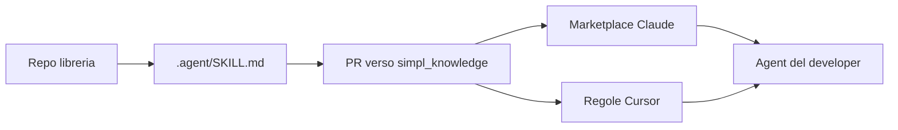

# simpl_knowledge

`simpl_knowledge` è il punto centrale dove **simpl-techs** distribuisce contesto agli agenti AI del team.

Il problema che risolve è semplice: ogni repo ha convenzioni, librerie interne e decisioni tecniche che un agent non conosce da solo. Senza un sistema comune, ogni developer deve rispiegare le stesse cose oppure l’agent rischia di duplicare codice già esistente. Questo bundle dà agli agenti una base condivisa e aggiornata.

In pratica contiene:

- **Un marketplace Claude Code**: si aggiunge una volta con `/plugin marketplace add simpl-techs/simpl_knowledge` e poi si installano plugin con alias `@simpl`.
- **Regole Cursor**: gli stessi contenuti vengono convertiti in file `.mdc` e installati in `~/.cursor/rules/`.
- **Un catalogo delle librerie interne**: `catalog.md` / `catalog.json` dicono all’agent quali librerie esistono e quando usarle.
- **Un template per repo libreria**: ogni libreria può pubblicare il proprio `.agent/SKILL.md` dentro questo marketplace.
- **Hook condivisi**: aggiornano cache, regole Cursor e controlli base senza duplicare logica tra Cursor e Claude Code.

## Modello mentale

Ci sono due flussi distinti:

1. **Il developer consuma la knowledge**: installa il marketplace e le regole; da quel momento gli agent ricevono standard, catalogo e skill.
2. **Il maintainer di una libreria pubblica knowledge**: aggiorna `.agent/SKILL.md` nel repo della libreria; il workflow apre una PR su `simpl_knowledge`; dopo merge gli altri developer ricevono l’aggiornamento.

## Componenti principali

- **`simpl-standards`**: convenzioni condivise su codice, git, test, struttura dei repo. È il plugin che spiega “come lavoriamo a simpl”.
- **`simpl-memory`**: raccoglie pattern ricorrenti a fine sessione e li propone come “instinct”. Non promuove nulla da solo: serve review umana.
- **`simpl-libraries`**: contiene il catalogo delle librerie interne. L’agent lo consulta prima di implementare integrazioni o utility già disponibili.
- **`<repo>-context`**: plugin specifico di una libreria, generato dal suo `.agent/SKILL.md`. Si installa solo quando serve dettaglio pieno su quella libreria.
- **`library-repo-template/`**: scaffold per aggiungere `.agent/`, hook e workflow di sync a un repo libreria.

## Nomenclatura

| Concetto | Valore |
|----------|--------|
| Org GitHub | `simpl-techs` |
| Repo di questo bundle | `simpl-techs/simpl_knowledge` |
| Alias marketplace (comandi `/plugin install …@…`) | `simpl` |

Config di riferimento: [config/simpl.json](config/simpl.json).

| Audience | Start |
|----------|--------|
| Developer (uso quotidiano) | [docs/human/QUICKSTART.md](docs/human/QUICKSTART.md) |
| Admin (configurare l’org) | [docs/human/ADMIN_SETUP.md](docs/human/ADMIN_SETUP.md) |
| Maintainer libreria | [docs/human/QUICKSTART.md#sei-maintainer-di-una-libreria](docs/human/QUICKSTART.md#sei-maintainer-di-una-libreria) |
| Architettura completa | [docs/human/ARCHITECTURE.md](docs/human/ARCHITECTURE.md) |
| Agenti AI | [docs/agent/CONTEXT.md](docs/agent/CONTEXT.md) + skill `simpl_knowledge_system` |

## Install

- Developer (uso quotidiano): segui [docs/human/QUICKSTART.md](docs/human/QUICKSTART.md). Con il repo già clonato: dalla root, `bash scripts/team-bootstrap.sh`.
- Admin (setup iniziale dell'org): segui [docs/human/ADMIN_SETUP.md](docs/human/ADMIN_SETUP.md).

## Repo layout

- `library-repo-template/` — scaffold per repo libreria (`.agent/`, hook, workflow sync marketplace); usabile da agenti via cache plugin
- `plugins/simpl-standards` — policy condivise + meta-skill `simpl_knowledge_system`
- `plugins/simpl-memory` — instinct / continuous learning
- `plugins/simpl-libraries` — catalogo librerie interne (`catalog.md` / `catalog.json` generati in CI)
- `plugins/<lib>-context` — mirror di `.agent/SKILL.md` dal repo della libreria
- `catalog.md` / `catalog.json` — indice auto-generato di tutti i `*-context`
- `provenance.jsonl` — log append-only dei sync
- `config/simpl.json` — costanti org/repo/modelli

## CI

Il repo centrale include [.github/workflows/release-cursor-rules.yml](.github/workflows/release-cursor-rules.yml), che rigenera la release GitHub `cursor-rules-rolling` quando cambiano gli skill sotto `plugins/**/SKILL.md` (o lo script generatore). Nei repo libreria pre-configurati ci sono `auto-update-skill.yml` e `sync-skill-to-marketplace.yml` ([library-repo-template/.github/workflows/](library-repo-template/.github/workflows/)). Dettagli sulla release Cursor: [docs/human/ADMIN_SETUP.md](docs/human/ADMIN_SETUP.md) (Passo 6).
