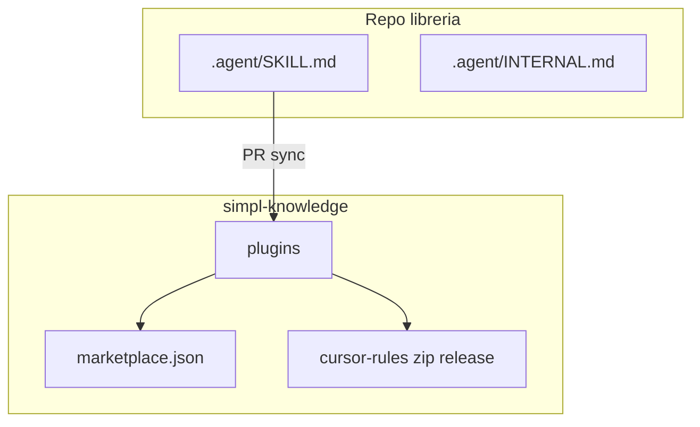
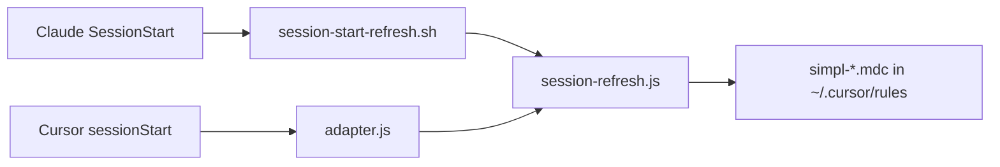

# Architettura

## Hook condivisi (Claude ↔ Cursor)

Stesso codice Node in `scripts/shared-hooks/`: Cursor passa da `adapter.js`; Claude Code chiama gli stessi file (direttamente o con shim). `session-refresh.js` allinea cache git + regole Cursor `simpl-*.mdc` su ogni sessione (throttle ~6h).

## Dove vive cosa

| Cosa | Dove | Note |
|------|------|------|
| Standard org-wide | `plugins/simpl-standards/skills/` | PR dirette su `simpl-knowledge` |
| Memoria / instinct | `plugins/simpl-memory/` | Dati locali sotto `~/.claude/simpl-memory/` |
| Integrazione lib X | `plugins/<repo>-context/` | **Generato** da sync da `.agent/SKILL.md` |
| Regole Cursor | Release `cursor-rules-rolling` | Da `SKILL.md`, non editare a mano |
| Audit sync | `provenance.jsonl` | Una riga JSON per sync |
| Scaffold repo libreria | `library-repo-template/` dentro `simpl-knowledge` | Drift vs template: report `.claude/.simpl-repo-report.json` + skill `repo-context-bootstrap` / `/bootstrap-repo-context` (solo dopo conferma utente) |

## Tre aggiornamenti (dal più al meno automatico)

1. **`/update-skill`** nel repo libreria (intenzionale).  
2. **Push `main`** su `.agent/SKILL.md` → workflow apre PR su `simpl-knowledge`.  
3. **Cron** `auto-update-skill` nel template libreria → PR bozza (review obbligatoria).
