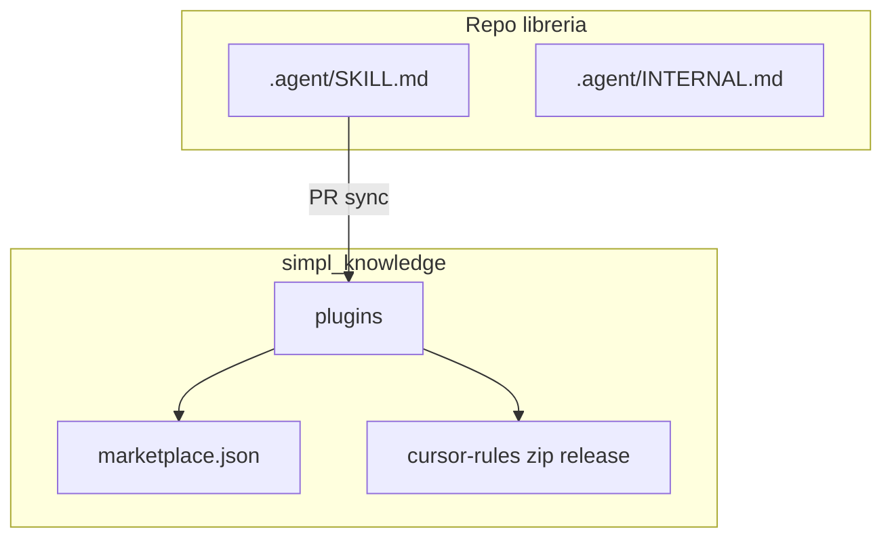
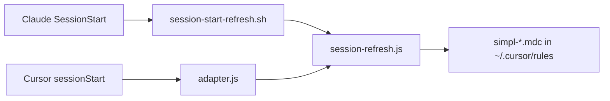

# Architettura

`simpl_knowledge` è un hub di distribuzione del contesto agentico. Non è un monolite applicativo: è un insieme di file Markdown, plugin Claude Code, regole Cursor, script e workflow.

L’idea centrale è avere una sola fonte verificabile per ogni tipo di knowledge:

- standard trasversali nel marketplace (`simpl-standards`);
- catalogo librerie in `simpl-libraries`;
- istruzioni pubbliche di una libreria nel suo `.agent/SKILL.md`;
- note interne di una libreria nel suo `.agent/INTERNAL.md`.

## I tre livelli

### 1. Hub: `simpl-techs/simpl_knowledge`

Questo repo contiene ciò che viene distribuito agli strumenti:

- plugin Claude Code sotto `plugins/`;
- catalogo generato `catalog.md` / `catalog.json`;
- script per install e sync;
- template per repo libreria;
- regole Cursor generate e pubblicate come release asset.

Il repo è il punto di arrivo delle PR di sync dei repo libreria.

### 2. Repo libreria

Ogni libreria resta proprietaria della propria knowledge pubblica:

- `.agent/SKILL.md`: come usare la libreria da altri repo;
- `.agent/INTERNAL.md`: come lavorare dentro quella libreria;
- workflow `sync-skill-to-marketplace`: copia lo skill nel marketplace dopo merge.

Questo evita che `simpl_knowledge` diventi una copia manuale e obsoleta di tutte le librerie.

### 3. Macchina del developer

Il developer riceve il contenuto in due modi:

- Claude Code: marketplace + plugin installati.
- Cursor: file `.mdc` in `~/.cursor/rules/` + hook `session-refresh`.

## Da repo libreria agli agent del team

1. Nel repo della libreria, la **fonte pubblica** è `.agent/SKILL.md` (INTERNAL resta locale).
2. Su merge in `main` che tocca `SKILL.md`, **`sync-skill-to-marketplace`** (dal template) crea/aggiorna il plugin `*-context` in **`simpl-techs/simpl_knowledge`** tramite PR.
3. Dopo merge nel marketplace, i developer aggiornano con `/plugin marketplace update`; **Cursor** riceve le stesse informazioni come regole **`simpl-*.mdc`** dalla release **`cursor-rules-rolling`**.
4. **`catalog.md` / `catalog.json`** riassumono ogni `*-context` così gli agent evitano duplicazioni.

## Esempio concreto

Se il repo `simpl_tracker` cambia il modo corretto di tracciare eventi:

1. il maintainer aggiorna `.agent/SKILL.md` in `simpl_tracker`;
2. merge su `main`;
3. il workflow apre una PR su `simpl-techs/simpl_knowledge`;
4. dopo merge, il plugin `simpl_tracker-context` e il catalogo vengono aggiornati;
5. un developer fa `/plugin marketplace update`;
6. quando chiede all’agent di aggiungere tracking, l’agent sa usare `simpl_tracker` invece di inventare una soluzione nuova.

## Hook condivisi (Claude ↔ Cursor)

Stesso codice Node in `scripts/shared-hooks/`: Cursor passa da `adapter.js`; Claude Code chiama gli stessi file (direttamente o con shim).

Questo serve a non mantenere due implementazioni diverse per gli stessi controlli. Per esempio `session-refresh.js`:

- aggiorna la cache git locale di `simpl_knowledge`;
- sincronizza regole Cursor `simpl-*.mdc`;
- può lanciare controlli sul template repo;
- fallisce in modo non bloccante, così non rompe l’IDE.

## Dove vive cosa

| Cosa | Dove | Note |
|------|------|------|
| Standard org-wide | `plugins/simpl-standards/skills/` | PR dirette su `simpl-techs/simpl_knowledge` |
| Memoria / instinct | `plugins/simpl-memory/` | Dati locali sotto `~/.claude/simpl-memory/` |
| Integrazione lib X | `plugins/<repo>-context/` | **Generato** da sync da `.agent/SKILL.md` |
| Regole Cursor | Release `cursor-rules-rolling` | Da `SKILL.md`, non editare a mano |
| Audit sync | `provenance.jsonl` | Una riga JSON per sync |
| Scaffold repo libreria | `library-repo-template/` dentro `simpl_knowledge` | Drift vs template: report `.claude/.simpl-repo-report.json` + skill `repo-context-bootstrap` / `/bootstrap-repo-context` (solo dopo conferma utente) |

## Tre aggiornamenti (dal più al meno automatico)

1. **`/update-skill`** nel repo libreria (intenzionale).  
2. **Push `main`** su `.agent/SKILL.md` → workflow apre PR su `simpl-techs/simpl_knowledge`.  
3. **Cron** `auto-update-skill` nel template libreria → PR bozza (review obbligatoria).

## Cosa non fa

- Non installa dipendenze runtime nei progetti.
- Non sostituisce review umana delle skill.
- Non decide da solo cosa diventa standard org-wide.
- Non mantiene documentazione interna privata dei repo: quella resta in `.agent/INTERNAL.md`.
