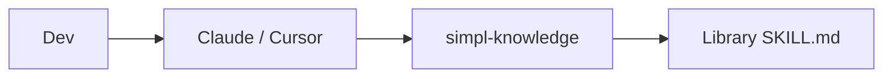

# Quickstart (simpl)

## 5 passi

1. **Repo centrale**: crea `simpl-techs/simpl-knowledge` (questo bundle) su GitHub, branch protection su `main`.
2. **Secrets org**: `DEEPSEEK_API_KEY` (workflow `auto-update-skill` su GitHub), `SIMPL_KNOWLEDGE_PAT` (scope repo su `simpl-knowledge`). In locale, per l’estrazione instinct serve la chiave del **provider** del modello in uso (Anthropic/OpenAI/DeepSeek), vedi `plugins/simpl-memory/PRIVACY.md`.
3. **Bootstrap dev**:  
   `curl -fsSL https://raw.githubusercontent.com/simpl-techs/simpl-knowledge/main/scripts/team-bootstrap.sh | bash`
4. **Claude Code** (nella sessione):  
   `/plugin marketplace add simpl-techs/simpl-knowledge`  
   `/plugin install simpl-standards@simpl-techs`, `simpl-memory@simpl-techs` (obbligatorio), e `simpl-libraries@simpl-techs` (catalogo librerie interne).
5. **Verifica**: chiedi all’agent *«come scriviamo i commit qui?»* → deve citare `git-workflow`.

| Prossimo passo | Dove |
|----------------|------|
| Architettura | [ARCHITECTURE.md](ARCHITECTURE.md) |
| Ruoli | [ROLES.md](ROLES.md) |
| Problemi | [TROUBLESHOOTING.md](TROUBLESHOOTING.md) |
