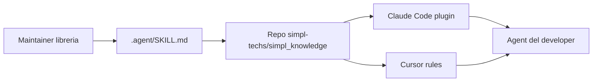

# Quickstart (developer)

Guida per usare gli agent del team. Per configurare il sistema da zero nell'org → [ADMIN_SETUP.md](ADMIN_SETUP.md).



---

## Passo 1 — Bootstrap

Stesso contenuto, **due modi**: install con **clone** da GitHub (consigliato) oppure **solo download** ed esecuzione di `team-bootstrap.sh`.

### Nome del repository su GitHub

Il valore ufficiale è in [config/simpl.json](../../config/simpl.json): `github_full_name` = `simpl-techs/simpl_knowledge`. Dopo `git clone`, la directory locale si chiama come il repo (`simpl_knowledge`). Se lavori in monorepo, la cartella `simpl_knowledge/` locale non è necessariamente il nome del remote.

### A — Clone da GitHub + bootstrap (consigliato)

Sostituisci `REPO` con `simpl_knowledge` (nome repo GitHub dell’org).

```bash
git clone https://github.com/simpl-techs/REPO.git
cd REPO
bash scripts/team-bootstrap.sh
```

Esempio con nome da config:

```bash
git clone https://github.com/simpl-techs/simpl_knowledge.git
cd simpl_knowledge
bash scripts/team-bootstrap.sh
```

### B — Solo download dello script (senza clone)

**Repo pubblico** — raw da `main`:

```bash
curl -fsSL "https://raw.githubusercontent.com/simpl-techs/REPO/main/scripts/team-bootstrap.sh" | bash
```

(`REPO` = `simpl_knowledge`.)

**Repo privato** — serve token (es. con GitHub CLI già autenticata):

```bash
curl -fsSL \
  -H "Authorization: Bearer $(gh auth token)" \
  -H "Accept: application/vnd.github.raw" \
  "https://api.github.com/repos/simpl-techs/REPO/contents/scripts/team-bootstrap.sh?ref=main" \
  | bash
```

Se ricevi **404** con il percorso pubblico `raw.githubusercontent.com`, è spesso repo privato o nome `REPO` errato: usa il blocco privato sopra oppure il percorso **A** dal clone.

Verifica accesso: `gh repo view simpl-techs/REPO` (con `REPO` corretto).

Lo script rileva da solo se hai Claude Code, Cursor o entrambi. È idempotente: rieseguilo per forzare un refresh.

## Passo 2 — Solo se hai Claude Code

Apri una sessione Claude Code e incolla (`owner/repo` = `simpl-techs/simpl_knowledge`):

```text
/plugin marketplace add simpl-techs/simpl_knowledge
/plugin install simpl-standards@simpl
/plugin install simpl-memory@simpl
/plugin install simpl-libraries@simpl
```

Questi comandi esistono solo dentro la sessione Claude Code, lo script non può eseguirli per te.

## Passo 3 — Opzionale: chiave per `simpl-memory`

Puoi saltare questo passo. Senza chiave, `simpl-memory` carica i comandi e gli hook ma **non scrive nuovi instinct**: nessun errore, semplicemente niente apprendimento.

Serve perché il plugin, a fine sessione, fa una chiamata HTTP a un provider per estrarre i pattern dal transcript: questa chiamata è separata da quella che Cursor o Claude Code fanno per la sessione interattiva, quindi non eredita la loro auth.

Se vuoi attivarlo, esporta **una** di queste env var (quella del provider compatibile col modello che usi in sessione):

```bash
export ANTHROPIC_API_KEY="..."   # Claude
export OPENAI_API_KEY="..."      # OpenAI
export DEEPSEEK_API_KEY="..."    # DeepSeek
export SIMPL_MEMORY_API_KEY="..." # fallback condiviso
```

**Condivisione team (opzionale):** per pubblicare i tuoi instinct nel feed org → `/share-instincts` nel plugin `simpl-memory`. Gli operatori designati mergiano i file in `team-instincts/instincts.jsonl` con `/aggregate-team-instincts`. Dettagli: [`team-instincts/README.md`](../../team-instincts/README.md).

## Passo 4 — Verifica

Apri Claude o Cursor in un repo qualsiasi e chiedi:

```text
come scriviamo i commit qui?
```

L'agent deve citare lo skill `git-workflow`. Se non lo cita → [TROUBLESHOOTING.md](TROUBLESHOOTING.md).

---

## Aggiornamenti

```text
/plugin marketplace update
```

Cursor si aggiorna da solo all'apertura della sessione (throttle ~6h). Per forzare: rilancia il bootstrap del Passo 1.

---

## Sei maintainer di una libreria?

1. `cd` nel tuo repo libreria.
2. Esegui:
   ```bash
   bash ~/.claude/plugins/cache/simpl_knowledge/library-repo-template/scripts/bootstrap.sh <repo-name>
   ```
3. Compila `.agent/SKILL.md` (rimuovi i placeholder `REPLACE-ME`), commit, push.
4. Al merge in `main`, il workflow `sync-skill-to-marketplace` apre PR sul repo centrale. Dopo il merge della PR, gli altri dev ricevono l'update con `/plugin marketplace update`.

---

Problemi? → [TROUBLESHOOTING.md](TROUBLESHOOTING.md)
