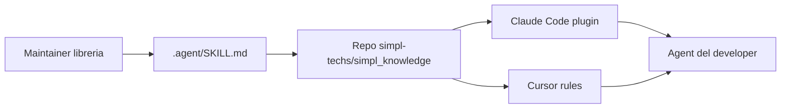

# Quickstart (developer)

Guida per usare gli agent del team. Per configurare il sistema da zero nell'org → [ADMIN_SETUP.md](ADMIN_SETUP.md).



---

## Passo 1 — Bootstrap

Stesso contenuto, **due modi**: install con **clone** da GitHub (consigliato) oppure **solo download** ed esecuzione di `team-bootstrap.sh`.

### A — Clone da GitHub + bootstrap (consigliato)

```bash
git clone https://github.com/simpl-techs/simpl_knowledge.git
cd simpl_knowledge
bash scripts/team-bootstrap.sh
```

### B — Solo download dello script (senza clone)

**Repo pubblico** — raw da `main`:

```bash
curl -fsSL "https://raw.githubusercontent.com/simpl-techs/simpl_knowledge/main/scripts/team-bootstrap.sh" | bash
```

**Repo privato** — serve token (es. con GitHub CLI già autenticata):

```bash
curl -fsSL \
  -H "Authorization: Bearer $(gh auth token)" \
  -H "Accept: application/vnd.github.raw" \
  "https://api.github.com/repos/simpl-techs/simpl_knowledge/contents/scripts/team-bootstrap.sh?ref=main" \
  | bash
```

Verifica accesso: `gh repo view simpl-techs/simpl_knowledge`.

Lo script rileva da solo se hai Claude Code, Cursor o entrambi. È idempotente: rieseguilo per forzare un refresh.

## Passo 2 — Solo se hai Claude Code

Apri una sessione Claude Code e incolla:

```text
/plugin marketplace add simpl-techs/simpl_knowledge
/plugin install simpl-standards@simpl
/plugin install simpl-memory@simpl
/plugin install simpl-libraries@simpl
```

Questi comandi esistono solo dentro la sessione Claude Code, lo script non può eseguirli per te.

Gli **instinct owner** (`Len378`, `n3ural`, `not-Karot`, vedi `config/simpl.json`) usano `/extract-instincts` per catturare pattern dalla sessione; gli altri dev ricevono i pattern team-wide al SessionStart. Dettagli: [`team-instincts/README.md`](../../team-instincts/README.md).

## Passo 3 — Verifica

Apri Claude o Cursor in un repo qualsiasi e chiedi:

```text
come scriviamo i commit qui?
```

L'agent deve citare lo skill `git-workflow`. Se non lo cita → [TROUBLESHOOTING.md](TROUBLESHOOTING.md).

---

## Aggiornamenti

**Perché** il repo centrale (`simpl_knowledge`) cambia regole, skill e plugin: devi sapere **che cosa** si aggiorna **dove** e **cosa fare tu**.

| Strumento | Cosa si aggiorna “in automatico” | Cosa fai tu, quando, perché |
|-----------|-----------------------------------|-----------------------------|
| **Cursor** | Con l’hook globale `session-refresh` (installato dal bootstrap), ad avvio sessione viene aggiornata circa **ogni ~6h** la **cache git** del bundle in `~/.claude/plugins/cache/simpl_knowledge` e copiate le regole org **`simpl-*.mdc`** in `~/.cursor/rules/`. Così resti allineato alle release / `main` senza rifare tutto ogni giorno. | Se serve **subito** (appena mergiato qualcosa sul hub): riesegui `team-bootstrap.sh` dal clone o elimina `.last-refresh` nella cache e riapri Cursor; vedi anche [TROUBLESHOOTING.md](TROUBLESHOOTING.md). |
| **Claude Code** | *Non* c’è lo stesso refresh automatico dei **plugin marketplace**: le skill vivono nei pacchetti che installi con `/plugin`. | Dopo che il team ha mergiato sull’hub (o vuoi solo allinearti): esegui **`/plugin marketplace update`** (e se serve una **nuova sessione** perché le skill si ricarichino). **Perché** così Claude scarica le versioni aggiornate dei plugin da `simpl-techs/simpl_knowledge`. |

Comando di riferimento in sessione Claude Code:

```text
/plugin marketplace update
```

**In sintesi:** Cursor → cache + `.mdc` con throttle ~6h; Claude Code → aggiornamento plugin **a mano** con `/plugin marketplace update` quando il marketplace è cambiato.

---

## Sei maintainer di una libreria?

1. `cd` nel tuo repo libreria.
2. Esegui:
   ```bash
   bash ~/.claude/plugins/cache/simpl_knowledge/library-repo-template/scripts/bootstrap.sh <repo-name>
   ```
3. Compila `.agent/SKILL.md` (rimuovi i placeholder `REPLACE-ME`), commit, push.
4. Al merge in `main`, il workflow `sync-skill-to-marketplace` apre PR sul repo centrale. Dopo il merge della PR, gli altri dev ricevono l'update con `/plugin marketplace update`.

---

Problemi? → [TROUBLESHOOTING.md](TROUBLESHOOTING.md)
