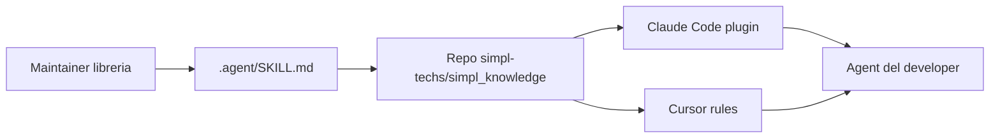

# Quickstart (developer)

Guida per usare gli agent del team. Per configurare il sistema da zero nell'org → [ADMIN_SETUP.md](ADMIN_SETUP.md).



---

## Passo 1 — Bootstrap

Stesso contenuto, **due modi**: install con **clone** da GitHub (consigliato) oppure **solo download** ed esecuzione di `team-bootstrap.sh`.

### A — Clone da GitHub + bootstrap (consigliato)

```bash
git clone https://github.com/simpl-techs/simpl_knowledge.git
cd simpl_knowledge
bash scripts/team-bootstrap.sh
```

### B — Solo download dello script (senza clone)

**Repo pubblico** — raw da `main`:

```bash
curl -fsSL "https://raw.githubusercontent.com/simpl-techs/simpl_knowledge/main/scripts/team-bootstrap.sh" | bash
```

**Repo privato** — serve token (es. con GitHub CLI già autenticata):

```bash
curl -fsSL \
  -H "Authorization: Bearer $(gh auth token)" \
  -H "Accept: application/vnd.github.raw" \
  "https://api.github.com/repos/simpl-techs/simpl_knowledge/contents/scripts/team-bootstrap.sh?ref=main" \
  | bash
```

Verifica accesso: `gh repo view simpl-techs/simpl_knowledge`.

Lo script rileva da solo se hai Claude Code, Cursor o entrambi. È idempotente: rieseguilo per forzare un refresh.

## Passo 2 — Claude Code (già fatto dallo script)

`team-bootstrap.sh` aggiunge il marketplace, installa i tre plugin globali e accende `autoUpdate`. Non serve digitare `/plugin`.

Gli **instinct owner** (`Len378`, `n3ural`, `not-Karot`, vedi `config/simpl.json`) usano `/extract-instincts` per catturare pattern dalla sessione; gli altri dev ricevono i pattern team-wide al SessionStart. Dettagli: [`team-instincts/README.md`](../../team-instincts/README.md).

## Passo 3 — Verifica

Apri Claude o Cursor in un repo qualsiasi e chiedi:

```text
come scriviamo i commit qui?
```

L'agent deve citare lo skill `git-workflow`. Se non lo cita → [TROUBLESHOOTING.md](TROUBLESHOOTING.md).

---

## Segreti (Doppler)

I secret del team stanno su Doppler, non in un `.env` pieno di chiavi. Installa la CLI Doppler. **Non** fare `doppler login` e **non** aprire la dashboard: chiedi a Raff, Iacopo o Flavio un token read-only `dev` per quel progetto, mettilo in `.env` come `DOPPLER_TOKEN`, poi `doppler run --config dev -- <comando>`. Dettaglio per agenti e maintainer: skill `doppler` in `simpl-standards`.

---

## Aggiornamenti

**Perché** il repo centrale (`simpl_knowledge`) cambia regole, skill e plugin: devi sapere **che cosa** si aggiorna **dove** e **cosa fare tu**.

| Strumento | Cosa si aggiorna “in automatico” | Cosa fai tu, quando, perché |
|-----------|-----------------------------------|-----------------------------|
| **Cursor** | L’hook globale `session-refresh` a ogni nuova chat fa fetch + `reset --hard` della cache git e sincronizza **`simpl-*.mdc`** da `cursor-rules/` (commit CI) o dallo zip `cursor-rules-rolling`. | Se serve **subito**: `SIMPL_KNOWLEDGE_FORCE_REFRESH=1` o `bash scripts/doctor.sh` / `team-bootstrap.sh`. |
| **Claude Code** | SessionStart `plugin-refresh`: self-heal del clone + `claude plugin update` se le versioni sono indietro. `autoUpdate: true` sul marketplace. Nuove versioni attive alla sessione successiva. | Niente. Se `doctor.sh` segnala ancora stale: `bash scripts/team-bootstrap.sh`. |

**In sintesi:** Cursor e Claude Code si aggiornano da soli. Unico comando per un PC nuovo: `bash scripts/team-bootstrap.sh`.

---

## Sei maintainer di una libreria?

1. `cd` nel tuo repo libreria.
2. Esegui:
   ```bash
   bash ~/.claude/plugins/cache/simpl_knowledge/library-repo-template/scripts/bootstrap.sh <repo-name>
   ```
3. Compila `.agent/SKILL.md` (rimuovi i placeholder `REPLACE-ME`), commit, push.
4. Al merge in `main`, il workflow `sync-skill-to-marketplace` apre PR sul repo centrale. Dopo il merge della PR, Cursor e Claude Code ricevono l’update alla sessione successiva.

---

Problemi? → [TROUBLESHOOTING.md](TROUBLESHOOTING.md)
