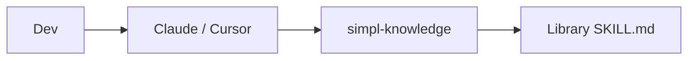

# Quickstart (simpl)

## 5 passi

1. **Repo centrale**: crea `simpl/simpl-knowledge` (questo bundle) su GitHub, branch protection su `main`.
2. **Secrets org**: `ANTHROPIC_API_KEY`, `SIMPL_KNOWLEDGE_PAT` (scope repo su `simpl-knowledge`).
3. **Bootstrap dev**:  
   `curl -fsSL https://raw.githubusercontent.com/simpl/simpl-knowledge/main/scripts/team-bootstrap.sh | bash`
4. **Claude Code** (nella sessione):  
   `/plugin marketplace add simpl/simpl-knowledge`  
   `/plugin install simpl-standards@simpl` e `simpl-memory@simpl` (memory opzionale).
5. **Verifica**: chiedi all’agent *«come scriviamo i commit qui?»* → deve citare `git-workflow`.

| Prossimo passo | Dove |
|----------------|------|
| Architettura | [ARCHITECTURE.md](ARCHITECTURE.md) |
| Ruoli | [ROLES.md](ROLES.md) |
| Problemi | [TROUBLESHOOTING.md](TROUBLESHOOTING.md) |
