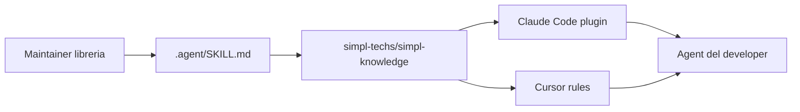

# Quickstart (developer)

Guida per usare gli agent del team. Per configurare il sistema da zero nell'org → [ADMIN_SETUP.md](ADMIN_SETUP.md).



---

## Passo 1 — Bootstrap

Esegui:

```bash
curl -fsSL https://raw.githubusercontent.com/simpl-techs/simpl-knowledge/main/scripts/team-bootstrap.sh | bash
```

Lo script rileva da solo se hai Claude Code, Cursor o entrambi. È idempotente: rieseguilo per forzare un refresh.

## Passo 2 — Solo se hai Claude Code

Apri una sessione Claude Code e incolla:

```text
/plugin marketplace add simpl-techs/simpl-knowledge
/plugin install simpl-standards@simpl
/plugin install simpl-memory@simpl
/plugin install simpl-libraries@simpl
```

Questi comandi esistono solo dentro la sessione Claude Code, lo script non può eseguirli per te.

## Passo 3 — Opzionale: chiave per `simpl-memory`

Puoi saltare questo passo. Senza chiave, `simpl-memory` carica i comandi e gli hook ma **non scrive nuovi instinct**: nessun errore, semplicemente niente apprendimento.

Serve perché il plugin, a fine sessione, fa una chiamata HTTP a un provider per estrarre i pattern dal transcript: questa chiamata è separata da quella che Cursor o Claude Code fanno per la sessione interattiva, quindi non eredita la loro auth.

Se vuoi attivarlo, esporta **una** di queste env var (quella del provider compatibile col modello che usi in sessione):

```bash
export ANTHROPIC_API_KEY="..."   # Claude
export OPENAI_API_KEY="..."      # OpenAI
export DEEPSEEK_API_KEY="..."    # DeepSeek
export SIMPL_MEMORY_API_KEY="..." # fallback condiviso
```

## Passo 4 — Verifica

Apri Claude o Cursor in un repo qualsiasi e chiedi:

```text
come scriviamo i commit qui?
```

L'agent deve citare lo skill `git-workflow`. Se non lo cita → [TROUBLESHOOTING.md](TROUBLESHOOTING.md).

---

## Aggiornamenti

```text
/plugin marketplace update
```

Cursor si aggiorna da solo all'apertura della sessione (throttle ~6h). Per forzare: rilancia il bootstrap del Passo 1.

---

## Sei maintainer di una libreria?

1. `cd` nel tuo repo libreria.
2. Esegui:
   ```bash
   bash ~/.claude/plugins/cache/simpl-knowledge/library-repo-template/scripts/bootstrap.sh <repo-name>
   ```
3. Compila `.agent/SKILL.md` (rimuovi i placeholder `REPLACE-ME`), commit, push.
4. Al merge in `main`, il workflow `sync-skill-to-marketplace` apre PR sul repo centrale. Dopo il merge della PR, gli altri dev ricevono l'update con `/plugin marketplace update`.

---

Problemi? → [TROUBLESHOOTING.md](TROUBLESHOOTING.md)
