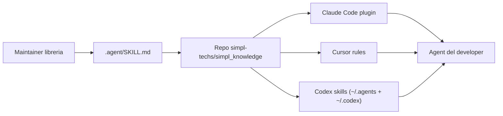

# Quickstart (developer)

Guida per usare gli agent del team. Per configurare il sistema da zero nell'org → [ADMIN_SETUP.md](ADMIN_SETUP.md).



---

## Passo 1 — Bootstrap

Stesso contenuto, **due modi**: install con **clone** da GitHub (consigliato) oppure **solo download** ed esecuzione di `team-bootstrap.sh`.

### A — Clone da GitHub + bootstrap (consigliato)

```bash
git clone https://github.com/simpl-techs/simpl_knowledge.git
cd simpl_knowledge
bash scripts/team-bootstrap.sh
```

### B — Solo download dello script (senza clone)

**Repo pubblico** — raw da `main`:

```bash
curl -fsSL "https://raw.githubusercontent.com/simpl-techs/simpl_knowledge/main/scripts/team-bootstrap.sh" | bash
```

**Repo privato** — serve token (es. con GitHub CLI già autenticata):

```bash
curl -fsSL \
  -H "Authorization: Bearer $(gh auth token)" \
  -H "Accept: application/vnd.github.raw" \
  "https://api.github.com/repos/simpl-techs/simpl_knowledge/contents/scripts/team-bootstrap.sh?ref=main" \
  | bash
```

Verifica accesso: `gh repo view simpl-techs/simpl_knowledge`.

Lo script rileva da solo quali strumenti hai (Claude Code, Cursor, Codex) e configura solo quelli. È idempotente: rieseguilo per forzare un refresh.

Prerequisiti: Git, Node e Python 3 disponibili nel terminale, più accesso Git al repository privato. Le regole Cursor arrivano dalla cache Git autenticata. `--dry-run` mostra il piano senza scrivere file. Il bootstrap termina con `doctor.sh`: un errore restituisce un codice diverso da zero. `install-team.sh` usa lo stesso installer.

La cache condivisa è `~/.simpl_knowledge/cache`. Il bootstrap sposta la vecchia `~/.claude/plugins/cache/simpl_knowledge` in un backup e aggiorna i link: la pulizia automatica della cache plugin Claude può cancellare file da quel vecchio percorso. I PC già configurati devono eseguire questo bootstrap una volta dopo il merge della migrazione.

## Passo 2 — Claude Code (già fatto dallo script)

`team-bootstrap.sh` aggiunge il marketplace, installa i tre plugin globali e accende `autoUpdate`. Non serve digitare `/plugin`.

Gli **instinct owner** (`Len378`, `n3ural`, `not-Karot`, vedi `config/simpl.json`) usano `/extract-instincts` per catturare pattern dalla sessione; gli altri dev ricevono i pattern team-wide al SessionStart. Dettagli: [`team-instincts/README.md`](../../team-instincts/README.md).

## Passo 2b — Codex (già fatto dallo script)

`team-bootstrap.sh` collega gli skill dell'org in `~/.agents/skills` e `~/.codex/skills` (symlink alla cache, così coprono sia la CLI sia l'estensione IDE) e scrive un blocco gestito in `~/.codex/AGENTS.md` tra i marker `<!-- simpl_knowledge:start -->` / `:end`. Quello che scrivi fuori dai marker resta tuo. Non serve installare plugin: Codex vede sia gli standard sia gli skill `*-context` di ogni libreria e carica quello che serve al task.

## Passo 3 — Verifica

Apri Claude, Cursor o Codex in un repo qualsiasi e chiedi:

```text
come scriviamo i commit qui?
```

L'agent deve citare lo skill `git-workflow`. Se non lo cita → [TROUBLESHOOTING.md](TROUBLESHOOTING.md).

`bash scripts/doctor.sh` verifica soltanto gli strumenti rilevati: cache aggiornata e pulita, contenuti degli hook e delle regole, versioni e auto-update Claude, tutti i link Codex e marker completi in `AGENTS.md`. Una collisione con una skill personale viene conservata e segnalata come installazione incompleta. Un doctor verde verifica i file e la configurazione; la domanda all'agente verifica che li stia usando.

---

## Segreti (Doppler)

I secret del team stanno su Doppler, non in un `.env` pieno di chiavi. Installa la CLI Doppler. **Non** fare `doppler login` e **non** aprire la dashboard: chiedi a Raff, Iacopo o Flavio un token read-only `dev` per quel progetto, mettilo in `.env` come `DOPPLER_TOKEN`, poi `doppler run --config dev -- <comando>`. Dettaglio per agenti e maintainer: skill `doppler` in `simpl-standards`.

---

## Aggiornamenti

**Perché** il repo centrale (`simpl_knowledge`) cambia regole, skill e plugin: devi sapere **che cosa** si aggiorna **dove** e **cosa fare tu**.

| Strumento | Cosa si aggiorna “in automatico” | Cosa fai tu, quando, perché |
|-----------|-----------------------------------|-----------------------------|
| **Cursor** | L’hook globale `session-refresh` a ogni nuova chat fa fetch + `reset --hard` della cache git e sincronizza **`simpl-*.mdc`** da `cursor-rules/` (commit CI) o dallo zip `cursor-rules-rolling`. Aggiorna anche gli hook stessi (`~/.cursor/hooks/shared-hooks/*.js` + `adapter.js`) dalla cache: il codice nuovo parte dalla sessione dopo. | Se serve **subito**: `SIMPL_KNOWLEDGE_FORCE_REFRESH=1` o `bash scripts/doctor.sh` / `team-bootstrap.sh`. |
| **Claude Code** | SessionStart `plugin-refresh`: self-heal del clone + `claude plugin update` se le versioni sono indietro. `autoUpdate: true` sul marketplace. Nuove versioni attive alla sessione successiva. | Niente. Se `doctor.sh` segnala ancora stale: `bash scripts/team-bootstrap.sh`. |
| **Codex** | Gli skill in `~/.agents/skills` e `~/.codex/skills` sono symlink alla cache: quando `session-refresh` (chat Cursor o Claude) aggiorna la cache, il contenuto è già nuovo. Lo stesso hook rilinka gli skill aggiunti o rinominati e riscrive il blocco in `~/.codex/AGENTS.md`. | Niente, se usi anche Cursor o Claude. Se usi **solo** Codex: `bash scripts/team-bootstrap.sh` quando vuoi allineare. |

Chi usa solo Codex deve rilanciare il bootstrap per aggiornare la cache. Con Cursor o Claude l'aggiornamento avviene dalle loro sessioni; il plugin globale Claude aggiorna anche la cache condivisa fuori dai repo dotati di hook locali. Le installazioni precedenti al supporto di auto-update richiedono un bootstrap una volta dopo il pull di `main`. Per un PC nuovo: `bash scripts/team-bootstrap.sh`.

---

## Sei maintainer di una libreria?

1. `cd` nel tuo repo libreria.
2. Esegui:
   ```bash
   bash ~/.simpl_knowledge/cache/library-repo-template/scripts/bootstrap.sh <repo-name>
   ```
3. Compila `.agent/SKILL.md` (rimuovi i placeholder `REPLACE-ME`), commit, push.
4. Al merge in `main`, il workflow `sync-skill-to-marketplace` pubblica lo skill direttamente su `main` del repo centrale (nessuna PR). Cursor e Claude Code ricevono l’update alla sessione successiva.

---

Problemi? → [TROUBLESHOOTING.md](TROUBLESHOOTING.md)
